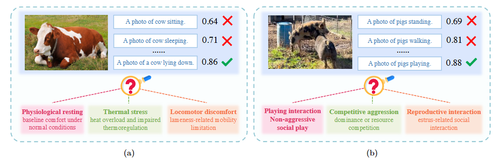
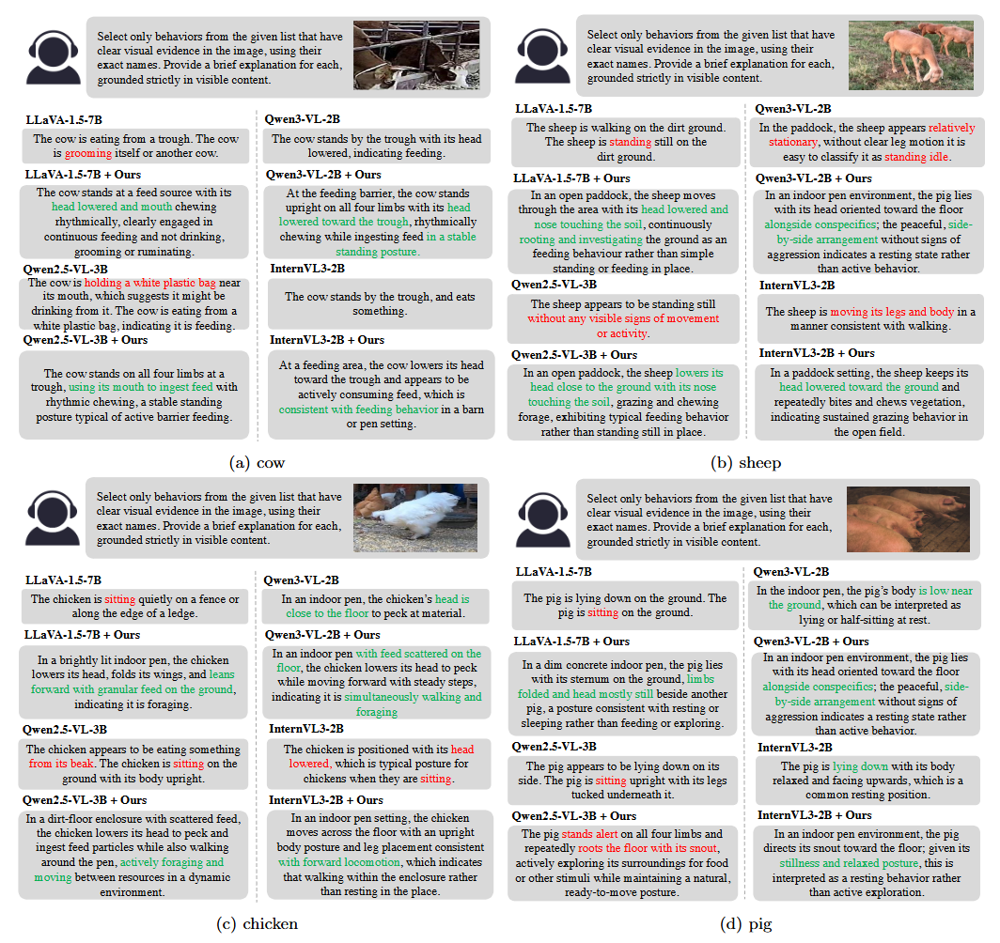

# Knowledge-Guided Interpretable Livestock Behavior Analysis with Retrieval-Augmented Reasoning

---

## 📌 Overview


We propose a **knowledge-guided retrieval-augmented reasoning framework** for livestock behavior analysis.
Unlike conventional methods that only predict behavior labels, our approach enables models to **understand and explain *why* behaviors occur**, improving interpretability in real-world farming scenarios.

---

## 💡 Motivation



Existing vision-language models (e.g., CLIP-based approaches) can recognize animal behaviors but fail to provide explanations.

For example:

* A cow lying down could indicate **rest**, **thermal stress**, or **lameness**
* A pig interaction could represent **play**, **aggression**, or **reproductive behavior**

However, traditional models only output labels without reasoning.

👉 Our goal is to move from **“What is the behavior?” → “Why does it occur?”**

---

## 🧩 Key Ideas

Our framework is built upon three key components:

### 1. Fine-grained Behavior Ethogram

* Constructed using domain knowledge (e.g., Wikipedia + multimodal models)
* Each behavior includes:

  * Definition
  * Context cues
  * Visual anchors
  * Negative delimiters

### 2. Explanation-enhanced Supervision

* Automatically generate natural language explanations
* Train models to produce interpretable reasoning

### 3. Retrieval-Augmented Reasoning

* Dynamically retrieve relevant behavior knowledge
* Inject into model prompts for improved reasoning

---

## 🧱 Method Overview


We construct structured behavior knowledge and use a lightweight retriever to inject relevant knowledge into vision-language models, enabling **knowledge-guided reasoning**.

---

## 📊 FLBE Dataset

We introduce the **Fine-grained Livestock Behavior Explanation (FLBE)** dataset, the first large-scale benchmark with explanation annotations.

| Dataset      |     #Images | #Actions | Source         | Scenario      | Labels | Long-tail | Explanation |
| ------------ | ----------: | -------: | -------------- | ------------- | ------ | --------- | ----------- |
| FLBE-Pig     |      55,165 |        6 | Web + Industry | Pen / Cage    | Multi  | ✓         | ✓           |
| FLBE-Cow     |      62,424 |        7 | Surveillance   | Day & Night   | Multi  | ✓         | ✓           |
| FLBE-Sheep   |      14,455 |        5 | Grazing        | Outdoor       | Multi  | ✓         | ✓           |
| FLBE-Chicken |      35,234 |        7 | Web            | Poultry House | Multi  | ✓         | ✓           |
| **Total**    | **167,278** |        — | Mixed          | Diverse       | Multi  | ✓         | ✓           |

---

## 📈 Results (Behavior Recognition)

---

### 🐷 Pig

| Method         | Acc    | Prec   | Rec    |
| -------------- | ------ | ------ | ------ |
| GPT-5          | 0.6338 | 0.6191 | 0.6073 |
| Gemini 3.0 Pro | 0.5926 | 0.5781 | 0.5587 |
| Qwen2.5-VL-3B  | 0.5675 | 0.2886 | 0.5181 |
| + Ours         | 0.5865 | 0.5456 | 0.5275 |
| Qwen3-VL-2B    | 0.5715 | 0.2814 | 0.5347 |
| + Ours         | 0.6126 | 0.5781 | 0.5569 |
| LLaVA-1.5-7B   | 0.6659 | 0.3553 | 0.6471 |
| + Ours         | 0.6892 | 0.5214 | 0.5275 |
| InternVL3-2B   | 0.6059 | 0.3127 | 0.5634 |
| + Ours         | 0.6321 | 0.5712 | 0.5856 |

---

### 🐔 Chicken

| Method         | Acc    | Prec   | Rec    |
| -------------- | ------ | ------ | ------ |
| GPT-5          | 0.3849 | 0.2865 | 0.2867 |
| Gemini 3.0 Pro | 0.4166 | 0.3174 | 0.2874 |
| Qwen2.5-VL-3B  | 0.3687 | 0.2261 | 0.3686 |
| + Ours         | 0.8090 | 0.4439 | 0.8069 |
| Qwen3-VL-2B    | 0.3920 | 0.2452 | 0.4013 |
| + Ours         | 0.8253 | 0.4717 | 0.8283 |
| LLaVA-1.5-7B   | 0.2618 | 0.1339 | 0.2618 |
| + Ours         | 0.7792 | 0.4182 | 0.7264 |
| InternVL3-2B   | 0.3618 | 0.2079 | 0.3386 |
| + Ours         | 0.8068 | 0.4615 | 0.8037 |

---

### 🐑 Sheep

| Method         | Acc    | Prec   | Rec    |
| -------------- | ------ | ------ | ------ |
| GPT-5          | 0.6634 | 0.5185 | 0.4402 |
| Gemini 3.0 Pro | 0.6763 | 0.4719 | 0.3990 |
| Qwen2.5-VL-3B  | 0.4413 | 0.3087 | 0.3928 |
| + Ours         | 0.8430 | 0.8271 | 0.7533 |
| Qwen3-VL-2B    | 0.4581 | 0.3159 | 0.4223 |
| + Ours         | 0.8682 | 0.8525 | 0.7816 |
| LLaVA-1.5-7B   | 0.3717 | 0.2145 | 0.3236 |
| + Ours         | 0.8035 | 0.7383 | 0.6954 |
| InternVL3-2B   | 0.4545 | 0.3294 | 0.4198 |
| + Ours         | 0.8645 | 0.8413 | 0.7768 |

---

### 🐄 Cow

| Method         | Acc    | Prec   | Rec    |
| -------------- | ------ | ------ | ------ |
| GPT-5          | 0.6725 | 0.5716 | 0.5936 |
| Gemini 3.0 Pro | 0.6395 | 0.6881 | 0.6155 |
| Qwen2.5-VL-3B  | 0.6755 | 0.4162 | 0.6352 |
| + Ours         | 0.7529 | 0.5960 | 0.6745 |
| Qwen3-VL-2B    | 0.6845 | 0.4286 | 0.6494 |
| + Ours         | 0.7757 | 0.6158 | 0.6893 |
| LLaVA-1.5-7B   | 0.5824 | 0.3185 | 0.5419 |
| + Ours         | 0.7872 | 0.6142 | 0.6638 |
| InternVL3-2B   | 0.7186 | 0.4871 | 0.6732 |
| + Ours         | 0.7969 | 0.6294 | 0.7021 |

---

## 📊 Explanation Quality

| Model | Pig (NLI) | Pig (GPT) | Chicken (NLI) | Chicken (GPT) | Sheep (NLI) | Sheep (GPT) | Cow (NLI) | Cow (GPT) |
|------|----------|----------|--------------|--------------|------------|------------|----------|----------|
| GPT-5 | 50.83 | 33.75 | 30.92 | 19.66 | 39.62 | 32.34 | 39.79 | 39.22 |
| Gemini 3.0 Pro | 50.78 | 38.10 | 28.93 | 27.09 | 30.57 | 24.60 | 33.56 | 43.80 |
| Qwen2.5-VL-3B | 44.36 | 24.45 | 28.15 | 15.71 | 33.86 | 21.81 | 32.70 | 21.57 |
| + Ours | 50.81 | 40.36 | 36.67 | 30.34 | 45.02 | 75.72 | 39.87 | 46.10 |
| Qwen3-VL-2B | 49.01 | 32.27 | 32.38 | 21.18 | 39.02 | 22.05 | 38.63 | 29.06 |
| + Ours | 51.56 | 41.42 | 37.42 | 31.38 | 46.12 | 77.11 | 41.02 | 47.52 |
| LLaVA-1.5-7B | 47.20 | 27.80 | 5.52 | 11.71 | 20.60 | 19.35 | 19.49 | 16.73 |
| + Ours | 53.55 | 35.73 | 30.71 | 24.80 | 42.57 | 57.91 | 37.03 | 41.88 |
| InternVL3-2B | 42.20 | 22.12 | 21.87 | 13.78 | 30.60 | 20.28 | 32.49 | 22.83 |
| + Ours | 49.58 | 36.91 | 34.72 | 28.94 | 44.36 | 74.85 | 38.94 | 45.67 |

---

## 🎯 Qualitative Results



Compared to baseline models, our method generates:

* More accurate behavior predictions
* More coherent and grounded explanations
* Less hallucination

---

## 🏆 Contributions

* Introduce interpretable livestock behavior analysis framework
* Propose retrieval-augmented reasoning for VLMs
* Construct the FLBE dataset with explanation annotations

---

## 📄 Paper

📎 [PDF Link Coming Soon]

---

## 📌 Citation

```bibtex
@article{yourname2025livestock,
  title={Knowledge-Guided Interpretable Livestock Behavior Analysis with Retrieval-Augmented Reasoning},
  author={...},
  journal={...},
  year={2025}
}
```

---

## ⭐ Acknowledgement

This project aims to advance **interpretable AI for precision livestock farming**.
